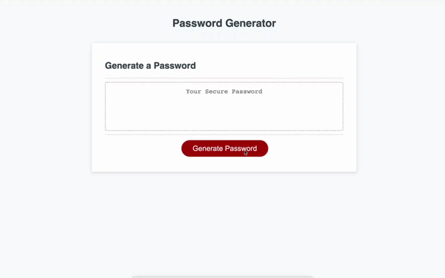

# Front-end Password Generator

[Password Generator](https://guitarkeegan.github.io/password-generator/)

## Description

This application will prompt the user for a series of criteria and generate a password based on their responses.

## Authors

Keegan Anglim
[@NageekDBeat](https://twitter.com/nageekdbeat)
Andres Long (test files)

## Version History

* 0.1
    * Initial Release

## License

This project is licensed under the MIT License - see the LICENSE.md file for details

## Acknowledgments

Test files and other considerations were provided by Andres Long.

## Screenshot

